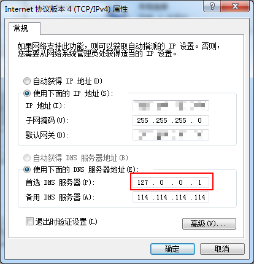

# lanDDNS

[https://github.com/xxxxst/lanDDNS](https://github.com/xxxxst/lanDDNS)

本地可信局域网的动态域名解析服务，适用于在使用动态IP的局域网中，使用域名代替IP地址的方式访问目标设备

- 支持*泛域名解析，可以代替windows下的hosts文件提供增强功能
- 底层基于ARP协议实现，不需要在目标设备安装通信软件
- 设计目标只对本机提供服务，不考虑专用域名解析服务所需要的高并发、高可用、或缓存等功能。
---

## 配置

- data/config.ini

配置文件，程序第一次启动后会自动生成。修改后需要重启程序

主要修改macIp参数，将其修改为需要监听的网段

```ini
[server]
; 服务IP地址，默认为所有可用IP
dnsIp             = 0.0.0.0
; 服务端口，默认为53，一般不能改变
dnsPort           = 53
; dns服务器地址，本地无法解析的域名使用该地址解析
defaultDnsServer1 = 114.114.114.114
; 备用dns服务器
defaultDnsServer2 = 8.8.8.8
; 启用静态域名解析，通过ip和域名的映射关系进行解析
useStaticHost     = true
; 启用基于Mac地址的域名解析，通过mac和域名的映射关系进行解析
useMacHost        = true
; 需要监听的网段，多个网段用','分开, 子网掩码固定为 255.255.255.0
macIp             = 192.168.0.0
; 将mac地址和ip的映射关系输出到日志中，如果不知道目标设备的mac地址
; 可以通过该记录查询，默认关闭
logMac            = false
```

- host.static.txt

ip域名映射表。修改后立即更新，无需重启程序

```sh
# [ip] [domain] [domain] ...
# domain support '*', examle: 
# 127.0.0.1 domain.lan www.domain.lan *.domain.lan

```

- host.mac.txt

mac域名映射表。修改后立即更新，无需重启程序

```sh
# [ip] [domain] [domain] ...
# domain support '*', examle: 
# 127.0.0.1 domain.lan www.domain.lan *.domain.lan

```

### windows配置

- 修改网卡的dns服务器地址为127.0.0.1。
- 将程序加入开机启动



## 编译

### windows

```bat
set GOARCH=386
set CGO_ENABLED=1

go build -ldflags "-s -w -H windowsgui" -o bin/release/lanDDNS.exe
```

## license

GPL-3.0

[LICENSE](./LICENSE)
